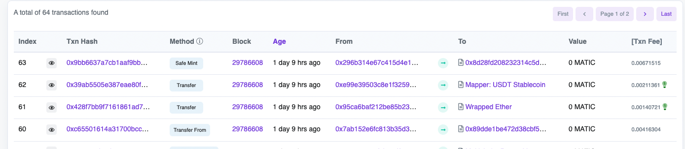

# txNonce

## Features

- Add Index column when viewing transactions of a block

Make it easy to view transaction index inside the block.




## How can use it?

1. clone the repo;
2. install dependencies:
```bash
yarn
```
3. build it:
```bash
yarn build
```
3. go to `chrome://extensions/`;
4. enable `Developer mode`;
5. `Load unpacked` and select the `extenstion` folder;


Icon :
<a href="https://iconscout.com/icons/book-number" target="_blank">Book Number Icon</a> by <a href="https://iconscout.com/contributors/fluent">Microsoft</a> on <a href="https://iconscout.com">IconScout</a>